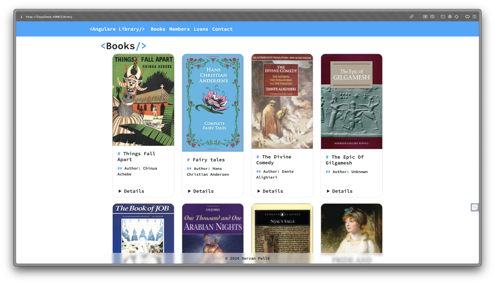
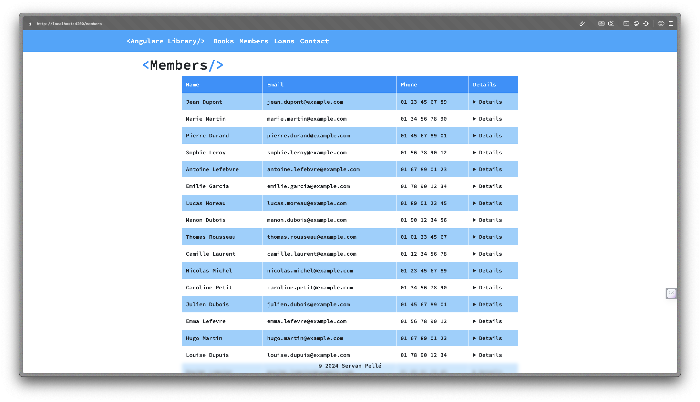
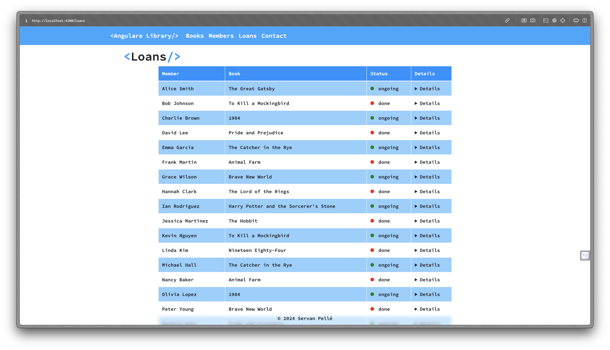
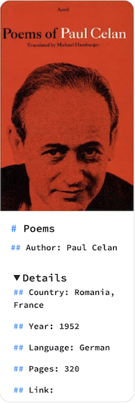
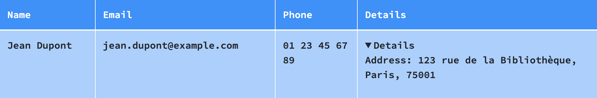
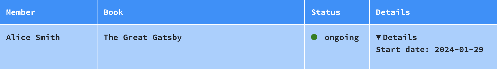

# AngularLibrary
Front-end app for a public library

Visit : https://angular-library-sigma.vercel.app/

<iframe
  src="https://angular-library-sigma.vercel.app/"
  style="width:100%; height:300px;"
></iframe>

## Subject

The project is to develop a front-end app for a public library that displays :
- a navigation bar with 
  - a link to books list
  - a link to members list
  - a link to loans list
  - a contact form

List are loaded from static json files stored in the backend.
Each list enables a click to a detail screen, showing the details of :
- a book
- a member
- an loan

Contact form enables to enter an email and a message, with a button to send the message (an alert or a modal will be displayed with the content entered).

## Modalities

Project has to be done individually or by pair.  

### Technical stack

Front-end will be built using Angular.

An additional CSS lib can be used for a better design, but it is not mandatory.

### Deliverables

The expected deliverable will be a Git repo or a zip of your source code, with all your source files.

Send the URL of the Git repo or the zip to your teacher thanks to Mootse.

Please send it for date 05/02 at 00:00

# Documentaion

## Get & Lunch project
1. Open local terminal.
2. `git clone https://github.com/pelleservan/AngularLibrary.git`
3. `cd angular-library`
4. `ng serve --open`

## Front-End

Using Bootstrap framework for front-end managment.

## Components

1. Commons : Header & Footer
2. Home
3. Library
4. Members
5. Loans
6. Contact

## Data
All the data stored in  `./angular-library/src/assets`.
### Library

Use JSON file from `https://github.com/benoitvallon/100-best-books.git`:
1. JSON file `./books.json` :
```json
{
    "author": "Chinua Achebe",
    "country": "Nigeria",
    "imageLink": "images/things-fall-apart.jpg",
    "language": "English",
    "link": "https://en.wikipedia.org/wiki/Things_Fall_Apart\n",
    "pages": 209,
    "title": "Things Fall Apart",
    "year": 1958
  }
```
2. Book cover `./static/images` :


We use this dataset to display a liste of books with some details. We can get more details with a click on details as is present below :

# ADD .gif

### Members

Use a JSON file written by ChatGPT with a given template :
1. Members `./angular-library/src/assets/members.json` :
```json
{
    "id": 1,
    "name": "Jean Dupont",
    "adress": "123 rue de la Bibliothèque",
    "city": "Paris",
    "postal_code": "75001",
    "email": "jean.dupont@example.com",
    "phone": "01 23 45 67 89"
  },
```

### Loans 

Use a JSON file writen by ChatGPT with a given template :
1. Loans `./angular-library/src/assets/loans.json` :
```json
{
    "id": 1,
    "user_name": "Alice Smith",
    "start_date": "2024-01-29",
    "book_title": "The Great Gatsby",
    "status": "ongoing"
  }
```

## Usage of data

To use data stored in `assets` we defind a interface in relevent components to load data from JSON.
1. Books `library.components.ts` :
```ts
interface Book {
  author: String;
  country: String;
  imageLink: String;
  language: String;
  link: String;
  pages: Number;
  title: String;
  year: Number;
}
```
2. Members `members.components.ts` :
```ts
interface Member {
  id: Number;
  name: String;
  adress: String;
  city: String;
  postal_code: String;
  email: String;
  phone: String;
}
```
3. Loans
```ts
interface Loan {
  id: Number;
  user_name: String;
  start_date: String;
  book_title:String;
  status: String;
}
```
To be use by the front we define tables of this interface in our class afeter imported the json files :
1. Books `library.components.ts` :
```ts
import membersData from '../../assets/members.json';

export class MembersComponent {
  members: Member[] = membersData;
}
```
2. Members `members.components.ts` :
```ts
import membersData from '../../members/members.json';

export class MembersComponent {
  members: Member[] = membersData;
}
```
3. Loans `members.components.ts` :
```ts
import membersData from '../../assets/loans.json';

export class LoansComponent {
  loans: Loan[] = loansData;
}
```

Now we can use the data in front.
1. Books `library.components.html` :
```html
<div class="card box-shadow h-100">
  
  <div class="card-body">
    <h5 class="card-title">{{ book.title }}</h5>
    <p class="card-text">Author: {{ book.author }}</p>
  </div>
  <details>
    <summary>Details</summary>
      <p class="card-text">Country: {{ book.country }}</p>
      <p class="card-text">Year: {{ book.year }}</p>
      <p class="card-text">Language: {{ book.language }}</p>
      <p class="card-text">Pages: {{ book.pages }}</p>
      <p class="card-text">Link: <a href="{{ book.link }}" target="_blank">{{ book.link }}</a></p>
  </details>
</div>
```
2. Members `members.components.html` :
```html
<table class="table table-bordered">
  <thead>
    <tr class="table-header">
      <th>Name</th>
      <th>Email</th>
      <th>Phone</th>
      <th>Details</th>
    </tr>
  </thead>
  <tbody>
    <ng-container *ngFor="let member of members; let i = index">
      <tr [ngClass]="i % 2 === 0 ? 'table-row-even' : 'table-row-odd'">
        <td>{{ member.name }}</td>
        <td>{{ member.email }}</td>
        <td>{{ member.phone }}</td>
        <td>
          <details>
            <summary>Details</summary>
            <p class="">Address: {{ member.adress }}, {{ member.city }}, {{ member.postal_code }}</p>
          </details>
        </td>
      </tr>
    </ng-container>
  </tbody>
</table>
```
3. Loans `loans.components.html` :
```html
<table class="table table-bordered">
  <thead>
    <tr class="table-header">
      <th>Member</th>
      <th>Book</th>
      <th>Status</th>
      <th>Details</th>
    </tr>
  </thead>
  <tbody>
    <ng-container *ngFor="let loan of loans; let i = index">
      <tr [ngClass]="i % 2 === 0 ? 'table-row-even' : 'table-row-odd'">
        <td>{{ loan.user_name }}</td>
        <td>{{ loan.book_title }}</td>
        <td>
          <span class="status-badge" [ngClass]="{ 'status-ongoing': loan.status === 'ongoing', 'status-done': loan.status === 'done' }"></span>
          {{ loan.status }}
        </td>
        <td>
          <details>
            <summary>Details</summary>
            <p class="">Start date: {{ loan.start_date }}</p>
          </details>
        </td>
      </tr>
    </ng-container>
  </tbody>
</table>
```
Thanks to this we can get the following 
1. Books `http://localhost:4200/library` :



2. Members `http://localhost:4200/members` :



3. Loans `http://localhost:4200/loans` :



## More details

To get more details about the different topics we can click on on `Details` button. To link this section to data we defind 

1. Books



2. Members



3. Loans



## Contact

1. Front-end :


2. Back-end :

## Routes
To get acces to this content we define a `header` for a better navigation and routes in `app.component`

1. Routes `./angular-library/src/app/app.component.ts` :
```ts
import { LibraryComponent } from './library/library.component';
import { MembersComponent } from './members/members.component';
import { LoansComponent } from './loans/loans.component';
import { ContactFormComponent } from './contact-form/contact-form.component';
import { HomeComponent } from './home/home.component';

export const routes: Routes = [
  { path: 'library', component: LibraryComponent },
  { path: 'members', component: MembersComponent },
  { path: 'loans', component: LoansComponent },
];
```

2. Header `./angular-library/src/app/core/header/header.component.html` :
```html
<header>
  <nav class="navbar navbar-expand-lg navbar-light">
    <div>
      <a class="navbar-brand" href="/home">{{ title }}</a>
      <button class="navbar-toggler" type="button" data-toggle="collapse" data-target="#navbarNav" aria-controls="navbarNav" aria-expanded="false" aria-label="Toggle navigation">
        <span class="navbar-toggler-icon"></span>
      </button>
    </div>
    <div class="collapse navbar-collapse" id="navbarNav">
      <ul class="navbar-nav">
        <li class="nav-item">
          <a class="nav-link active" href="/library">Books</a>
          <a class="nav-link active" href="/members">Members</a>
          <a class="nav-link active" href="/loans">Loans</a>
          <a class="nav-link active" href="/contact-form">Contact</a>
        </li>
      </ul>
    </div>
  </nav>
</header>
```

